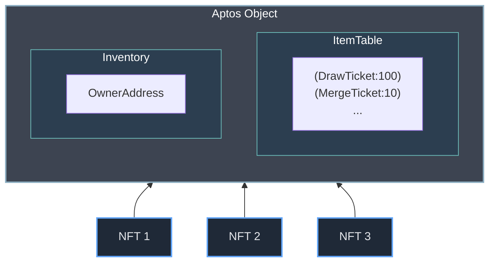

[](https://c4.ntroi.com)

# CrimeChase NFT Project

[](LICENSE.txt)

**CrimeChase** is a multi-functional NFT project built on the Aptos blockchain. It provides a comprehensive smart contract system for the creation, management, and tracking of digital assets (NFTs, items, certificates), supporting a secure and efficient on-chain experience.

## Overview

Beyond simple NFT issuance, CrimeChase aims to provide an integrated environment where users can effectively own and interact with their digital assets. Utilizing Aptos's Object Model, each asset (token, inventory item, certificate) is managed as an independent object, enhancing flexibility and scalability.

## Module Descriptions

### certification_center:
- Sensitive functions such as token creation, deletion, and inventory creation can only be performed through authorized accounts.
- In addition to the module account, additional accounts can be registered to perform transactions in parallel.
- **certification_center_v1**: Uses [Aptos Multi-Agent Transaction](https://aptos.dev/en/build/sdks/ts-sdk/building-transactions/multi-agent-transactions) for certificate issuance & authorization. Certificates are registered in the Resource of the account being added.
- **certification_center_v2**: Traditional address-based certificate issuance & authorization. The admin account's Resource manages authorized addresses as a List.

### app_signer:
- A signer that maintains consistency across various functions performed in the module.
- Even when activities occur through various accounts with registered certificates, a consistent creator is maintained through the app_signer.

### inventory:
- A conceptual container for managing users' various NFT tokens and items.
- Inventory addresses are managed by hashing unique account numbers rather than user addresses directly.
- Custom items are organized in an ItemTable (a simple_map) with key (string, item type) - value (u64, item quantity).
- Inventory does not have a separate container for NFTs. Actively utilizing Aptos's Object structure, NFT ownership is set to Inventory for management.
- **Ownership Model**: The inventory is owned by the service provider, not the end user, and provides transfer functionality between the inventory and users' wallets. This transfer capability is controlled by the token's lock/unlock status. This design choice enhances security for NFT usage within in-game services and other applications, preventing unauthorized transfers while tokens are being actively used in the ecosystem.



### crimechase_token:
- [Aptos Digital Asset(DA)](https://aptos.dev/en/build/smart-contracts/digital-asset) standard is followed.
- **Core Function**: Manages the entire lifecycle of NFTs, including creation, transfer, and burning.
- **Characteristics**:
  - Supports rich metadata (name, description, URI) and custom properties.
  - Systematic NFT classification through collection and subcollection structures.
  - Provides various control functions like transfer restrictions, burning, and locking/unlocking.
  - Resettable properties feature that allows modification of token properties after minting, including the ability to reset property values.

## Key Features

- **Integrated Asset Management**: Manage various digital assets like NFTs, game items within a single project.
- **Modular Design**: Easy maintenance and scalability due to functional module separation.
- **Leverages Aptos Object Model**: Clear ownership and management by representing each asset as an object.
- **Flexible Metadata and Properties**: Assign diverse metadata and custom properties to tokens, items, and certificates.
- **Efficient Batch Operations**: Supports processing multiple assets in a single transaction.
- **Enhanced Access Control**: Strengthens asset security through features like token transfer restrictions and locking mechanisms.

## Getting Started

### Clone the Repository:
```bash
git clone https://github.com/ntroi/crimechase_move
cd crimechase_move
```

### Set Up Development Environment:
(Use sh-scripts/dev_setup.sh script if needed)
- Install Aptos CLI and set up a profile (aptos init).

### Update Package Configuration:
- Open the Move.toml file and modify the following:
  - Change the package name from `your_package_name` to your actual project name  
```toml
[package]
name = "your_package_name" # Change to your project name
version = "1.0.1"
authors = []
upgrade_policy = "compatible"
```

### Deploy the Contract:
- Run the sh-scripts/move_publish.sh script or use the command below (Requires PROFILE environment variable).
```bash
# PROFILE=your_profile_name (e.g., default, devnet_admin)
# Addr=<your_account_address>
aptos move publish --named-addresses crimechase=$Addr --profile $PROFILE --assume-yes
```

or
```bash
aptos move publish --named-addresses crimechase=$PROFILE --profile $PROFILE --assume-yes
```

### Interact with the System:
Use Aptos CLI or SDKs to call functions on the deployed contract.

## Development

### Compile:
```bash
# Addr=<your_account_address>
aptos move compile --named-addresses crimechase=$Addr
```

### Run Tests:
(Can use sh-scripts/move_tests.sh script)
```bash
aptos move test
```

## Testing

Each module includes test cases covering key functionalities such as:

- Token management tests (creation, transfer, property changes, etc.)
- Inventory operation tests (adding items, transfers, quantity changes, etc.)
- Certification system tests (issuance, verification, ownership transfer, etc.)
- Batch operation functionality tests.

## License

This project is distributed under the [Apache 2.0](LICENSE.txt).
